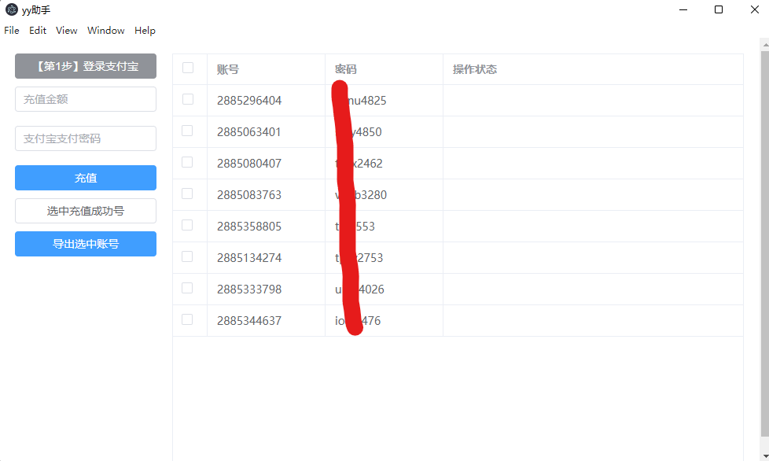

# 说明

没有什么特殊说明，这是一个基于electron + vite + puppeteer自动化测试工具来实现的支付宝自动输入支付密码进行账单支付yb的工具， 实现了跨平台独立运行的便捷性，该原理同样可以运用到爬虫领域，实现可视化爬虫。

# 使用方式
 - npm run dev 调试
 - npm run build 编译

# 功能截图

## 声明

**本项目仅供技术研究，请勿用于任何商业用途，请勿用于非法用途，如有任何人凭此做何非法事情，均于作者无关，特此声明。**